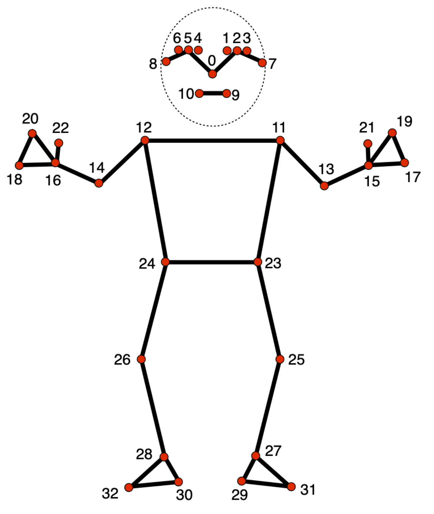

## Struggles
- mediapipe -> frame interpolation (biceps ok)
- back arch
- video angle matters a lot

  


## Remaining Tasks
### Engine/Backend
- Fine tune thresholds
- improve frame interpolation?
- add extra exercises if wanted?

### User Interface
- Add user input for exercise type
- User Input Notes (how to setup camera, warnings, etc)
- Color Stuff

### Presentation
- Virtual Poster

# Set Up
To run:  
```uvicorn main:app --reload```
